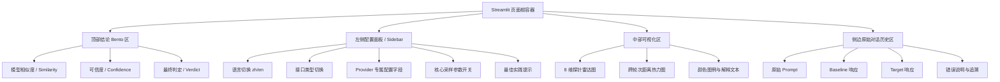

# ShadowHunter-X UI 与多接口重构设计文档

> **For Claude:** REQUIRED SUB-SKILL: Use superpowers:executing-plans to implement this plan task-by-task.

**Goal:** 在现有 Streamlit 单体架构基础上，重构 ShadowHunter-X 的 UI 交互体验、多模型接口适配和专业数据可视化，使其同时具备中文优先、中英文切换、多 Provider 配置和更可靠的错误反馈能力。

**Architecture:** 保持 `Streamlit + Python` 单体架构不变，避免前后端分离带来的跨域、双进程和部署复杂度。UI 层负责双语布局、Provider 配置面板、图表和原始审计历史；`adapters/` 负责六类接口格式适配与原始 HTTP 回退；`core/` 负责探针、距离和评分计算；`ui/` 负责图表 Option 与主题样式。

**Tech Stack:** Python 3.11, Streamlit, streamlit-echarts, LiteLLM, httpx, sentence-transformers, numpy, scipy, tenacity, pytest.

---

## 1. UI 交互逻辑图解

### 1.1 页面层级关系



### 1.2 交互流说明

用户进入页面后，默认看到中文界面和 Bento Grid 仪表盘。左侧配置区先选择语言，再选择接口格式，例如 `OpenAI Responses`、`OpenAI Compatible`、`Anthropic`、`Amazon Bedrock` 或 `Google Gemini`。选中接口类型后，面板只展示该 Provider 需要的字段，并对每个参数用中文 Tooltip 解释“这是什么”“什么时候改”“最佳实践是什么”。核心参数采用“默认开启、用户可手动关闭”的方式，避免误把高噪声参数带进审计流程。

点击“启动深度审计”后，页面顶部先展示进度与状态信息，中部图表区域随结果返回逐步更新。顶部结论区采用双语大字体指标卡，颜色随结果变化：绿色代表可信/相似，红色代表风险/漂移。右侧或折叠侧栏保留原始探针对话历史，让用户能快速追溯某一轮 probe 到底输入了什么、模型返回了什么、哪一步报错。

如果当前设计方向符合预期，我继续给出接口适配与代码实现部分。

## 2. 多接口适配与核心请求逻辑

### 2.1 六类接口格式的抽象原则

接口层统一抽象为 `UnifiedGateway(provider, model, api_key, base_url, interface_type)`，UI 不直接关心请求头、路径和 Body 结构，而只选择“接口类型”。内部按 `interface_type` 路由到对应适配分支：

- `openai_responses`: `POST /v1/responses`，Body 核心字段为 `model` + `input`
- `openai_compatible`: `POST /v1/chat/completions`，Body 核心字段为 `model` + `messages`
- `openai_compatible_chat`: 与上类似，但允许兼容更传统聊天型代理
- `anthropic`: `POST /v1/messages`，需带 `x-api-key` 和 `anthropic-version`
- `amazon_bedrock`: 通过区域、访问密钥和签名上下文构建 Bedrock 请求
- `google_gemini`: 使用 `contents` 结构，而不是 OpenAI 的 `messages`

这层抽象的价值是：UI 可以稳定，算法可以稳定，只有网关负责“平台差异”。在当前项目里，最重要的发现是某些 New API 网关对 GPT-5 系列更适合走 `Responses` 接口，而不是 `chat/completions`。同时，部分 OpenAI Compatible 网关对 `top_p` 参数敏感，甚至会把它错误解释成鉴权失败。因此兼容层必须根据接口类型细粒度控制参数。

### 2.2 适配器实现重点

核心策略有三条：

1. **LiteLLM 优先，原始 HTTP 回退**：对通用兼容路径仍优先复用 LiteLLM，但在兼容异常、SSE 空响应、网关阻断时自动回退到 `httpx` 原始请求。
2. **按接口类型定制参数白名单**：`openai_compatible` 默认省略 `top_p`，避免网关误处理；`openai_responses` 走最小请求体，只发 `model` 与 `input`。
3. **响应解析多分支**：兼容 `choices[].message.content`、`choices[].delta.content`、`response.output_text`、`output[].content[].text` 以及 `text/event-stream` 的 chunk 聚合。

### 2.3 示例代码

```python
class UnifiedGateway:
    async def async_generate(self, prompt: str) -> str:
        if self.interface_type == "openai_responses":
            return await self._generate_via_responses(prompt)
        return await self._generate_via_completion(prompt)

    async def _generate_via_responses(self, prompt: str) -> str:
        response = await client.post(
            f"{self.base_url.rstrip('/')}/responses",
            headers={
                "Authorization": f"Bearer {self.api_key}",
                "Content-Type": "application/json",
            },
            json={"model": self.model_id, "input": prompt},
        )
        response.raise_for_status()
        return self._extract_responses_output(response.json())

    async def _generate_via_completion(self, prompt: str) -> str:
        request_kwargs = {
            "model": self.model_id,
            "messages": [{"role": "user", "content": prompt}],
            "temperature": 0.3,
            "max_tokens": 512,
            "stream": False,
        }
        if self.interface_type not in {"openai_compatible", "openai_compatible_chat"}:
            request_kwargs["top_p"] = 0.9
        ...
```

如果这部分没问题，我继续写 UI 实现方案和算法到评分映射部分。

## 3. UI 实现方案

### 3.1 中英文双语与中文优先

UI 默认语言设置为 `zh`，同时在 Sidebar 顶部提供 `zh / en` 切换。所有标题、字段名、指标名、错误说明和图表说明都通过 `translations` 字典集中管理，而不是在页面里硬编码字符串。这样可以保证：

- 中文是默认交互语言
- 英文切换不会破坏布局
- 后续新增 Provider 字段时，语言包可集中扩展

Provider 配置字段同样通过 `build_interface_field_specs()` 统一定义，每个字段包含：`key`、`label`、`help`、`enabled`。`help` 直接接到 Streamlit 的 `help=` 参数上，形成 Tooltip。中文说明必须包含两类信息：

- 参数含义：例如 Temperature 是采样温度，影响输出离散程度
- 最佳实践：例如 OpenAI Compatible 场景中建议关闭 Top-P，以减少兼容性问题与额外噪声

### 3.2 图表与可视化语义增强

雷达图使用双语轴标签，例如 `逻辑陷阱 / Logical Consistency`。热力图加入 `visualMap` 图例，明确表达“浅蓝 = 低距离 / 高相似度，深色 = 逻辑漂移”。此外，在热力图组件旁增加一句话解释，用自然语言告诉用户当前颜色不是“好看程度”，而是“跨轮次偏差强弱”。

对于结论区，三个核心指标卡全部改成中英文双语，例如：

- `模型相似度 / Similarity`
- `可信度评分 / Confidence`
- `最终判定 / Verdict`

并根据阈值自动换色：高可信显示绿色，风险高显示红色，过渡态使用橙色。由于 Streamlit 原生动画有限，可通过 ECharts 自带动画完成雷达图展开与热力图渐入，再辅以 CSS 做卡片 hover 和淡入效果。

### 3.3 错误反馈机制

错误反馈必须从“原始错误”升级为“用户能看懂的错误”。策略是双层展示：

- 第一层：保留原始错误字符串，方便技术排查
- 第二层：用 `classify_error_message()` 输出中文解释，比如：
  - `Invalid API key` -> `API Key 无效，请检查是否复制完整或是否绑定当前网关`
  - `blocked` -> `请求被上游拦截，通常是接口类型不匹配或模型无权限`
  - `rate limit` -> `触发频率限制，请稍后重试或降低轮次`

这样页面既对开发者透明，也对非技术用户友好。

如果这部分方向正确，我继续给出算法更新与 UI 评分映射的最终部分。

## 4. 算法更新与 UI 评分映射

### 4.1 探针与距离计算细化

审计引擎保持“8 维对抗探针 + 三轮陷阱”结构：第一轮做无害铺垫，第二轮建立上下文，第三轮注入真正的探针 Payload。这样能更稳定地绕过简单包装层，逼近底层模型行为。每轮结果保留原始 Prompt、Baseline 响应和 Target 响应，为 UI 的原始历史框提供可追溯证据。

距离计算继续采用多模态方式：

- **语义距离**：使用文本嵌入后做余弦距离
- **结构距离**：从 Markdown 标记提取标题、列表、代码块等标签集合，做 Jaccard 距离
- **综合距离**：`0.8 * semantic + 0.2 * structural`

在 UI 上，雷达图显示的不是原始距离，而是“归一化后的特征得分”，便于视觉理解；热力图显示的是跨轮次综合距离矩阵，用颜色直观表达漂移程度。

### 4.2 统计算法与结论指标

核心统计仍是 Cross/Self Ratio：

- `S_base = Median(D(A_i, A_j))`
- `S_target = Median(D(B_i, B_j))`
- `C_cross = Median(D(A_i, B_i))`
- `Ratio = C_cross / (max(S_base, S_target) + 0.01)`

然后映射成三类 UI 结论：

1. **模型相似度 / Similarity**
   - 指数衰减函数映射为百分制
   - 颜色规则：高分绿色，中间橙色，低分红色
2. **可信度评分 / Confidence**
   - 成功率 × 方差惩罚
   - 低可信时必须提示“结果仅供参考”
3. **最终判定 / Verdict**
   - `VERIFIED` / `FRAUD DETECTED` / `INCONCLUSIVE`
   - 使用大字体双语展示，作为顶部最显眼的结论区

这种做法把学术上的探针、距离和统计判定翻译成用户能看懂的“得分 + 颜色 + 图表 + 原始证据”，从而把 ShadowHunter-X 从“能跑算法”提升为“能解释结论”的专业审计工作台。

---

## 5. 推荐落地顺序

1. 先扩展 `UnifiedGateway`，稳定六类接口切换与回退路径。
2. 再重构 `app.py` 的双语文案、Provider 字段和 Tooltip。
3. 最后升级 `ui/charts.py` 与主题样式，把雷达图、热力图和结论区做成完整 Bento Dashboard。

## 6. 当前代码对应关系

- `app.py`：语言切换、接口类型切换、Provider 字段、错误解释、Bento 布局主入口
- `adapters/llm_gateway.py`：六类接口格式适配、LiteLLM 优先、HTTP 回退、SSE/Responses 解析
- `ui/charts.py`：双语雷达轴、热力图图例和解释文案
- `core/engine.py`：多轮探针调度、原始交互沉淀、错误汇总

## 7. 下一步实施建议

- 将 `Anthropic / Bedrock / Gemini` 的专属字段真正接入运行时凭证映射，而不只是 UI 展示。
- 为原始探针对话历史框增加过滤器，按 probe 维度、轮次或错误状态筛选。
- 为热力图和雷达图增加动画配置与 hover 提示细节，进一步提升专业感。
